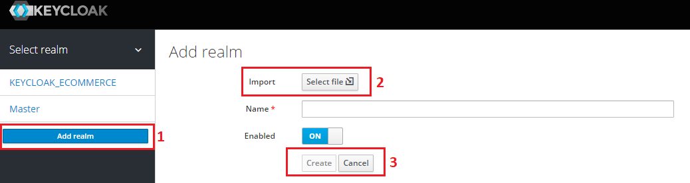
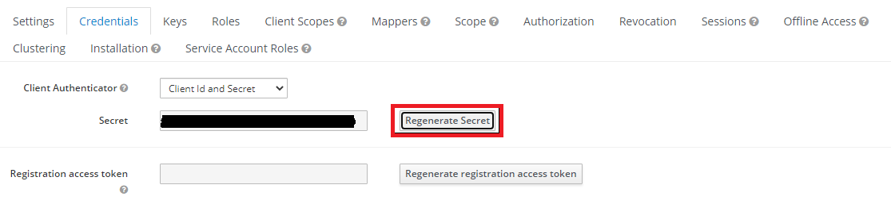

### Dev

Run docker compose

`docker-compose up -d`

Build lib

`npx nest build proto-schema`

Use consul docker

`docker run -d --name=dev-consul -p 8500:8500 -e CONSUL_BIND_INTERFACE=eth0 consul`

Use jaeger docker (tracing)

```
docker run -d --name jaeger \
  -e COLLECTOR_ZIPKIN_HOST_PORT=:9411 \
  -p 5775:5775/udp \
  -p 6831:6831/udp \
  -p 6832:6832/udp \
  -p 5778:5778 \
  -p 16686:16686 \
  -p 14268:14268 \
  -p 14250:14250 \
  -p 9411:9411 \
  jaegertracing/all-in-one:1.27
```

### Start service

Run debug

`npm nest start service-catalog`

Build service

`npm nest build service-catalog`

Run service ( use for low memory )

`node dist/apps/service-catalog/main.js`

### Keycloak

```bash
# run docker file
$ docker-compose up -d
```

Import seed data from seed folder

1. Right click sidebar, select `Add realm` button
2. Click `Select file` button, choose file realm-export.json
3. Press `Create`



4. Update client secret

Chọn client `GRAPHQL`




5. Replace new secret in env `KEYCLOAK_GRAPHQL_CLIENT_SECRET`

### Document

Nestcloud grpc example

https://github.com/nest-cloud/nestcloud-grpc-example

### Lib

https://github.com/pelotom/runtypes

https://gcanti.github.io/fp-ts/ecosystem

### Protoc for Windows

```bash
# install protoc with administrator right
$ choco install protoc

# update cmd gent-ts.sh for windows
--plugin=node_modules/ts-proto/protoc-gen-ts_proto.cmd

# using git bash
$ npm run setup:local
```

### CQRS

Export impl before handlers

### Database

https://docs.google.com/spreadsheets/d/1IE02omvZEwcwfoIFLvyNZx9LL1MBLom8/edit?usp=sharing&ouid=110428827386710835408&rtpof=true&sd=true

### How to add a module?

### With Microservice

1. Create proto in libs/proto-schema/proto and add to service
2. Create module in service folder and add to AppModule

### With Gateway

1. Create entity and repository in libs/repository
2. Create module in gateway folder and add to AppModule

### Fix common not found proto vscode

1. Install package vscode-proto3
2. Open settings.json add below option

```
"protoc": {
    "options": ["--proto_path=libs/proto-schema/src/proto"],
    "use_absolute_path": true
  }
```
